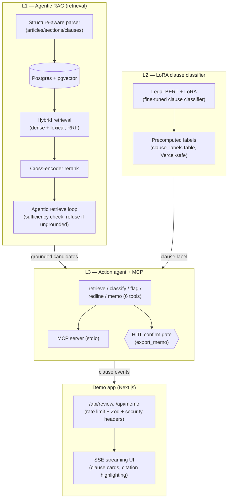

# sift — Grounded Contract Clause Review Copilot

An agentic, citation-grounded NDA-review copilot. It extracts clauses, flags deviations against
a playbook, drafts redlines, and exports a review memo behind an explicit human confirmation —
grounding every claim in a cited source span and **refusing when it can't ground an answer**.

Not legal advice — a human decides. Built and evaluated on public data only (CUAD, ContractNLI).
NDA is the wedge, not the ceiling: see `SPEC.md` for the full plan.

**Demo:** coming soon
<!-- TODO(deploy): demo URL -->

<!-- TODO(deploy): demo GIF/walkthrough — human-recorded, see Task 11/12 notes -->

---

## What it is

Given an NDA and a review objective, sift:
1. **Retrieves** the relevant clause via hybrid dense + lexical search over a structure-aware
   parse of the contract, reranked and looped through an agentic sufficiency check.
2. **Classifies** the clause type with a LoRA-fine-tuned Legal-BERT model.
3. **Flags** deviations against an NDA playbook (or a missing-required-clause finding, grounded
   in absence).
4. **Drafts a redline** for flagged clauses.
5. **Exports a review memo** — a preview only, until a human clicks "confirm."

Every factual claim carries a citation of the exact form
`{ doc_id, char_start, char_end, quote }`, where `quote === raw_text.slice(char_start, char_end)`
**exactly** — enforced by `core/src/schemas/clauseCard.ts`'s `assertCardCitations` and tested in
`core/test/schemas.test.ts`. When retrieval can't ground an answer, the system says so instead of
guessing.

## Architecture

Three layers (per `SPEC.md`), plus the demo app that wraps them:



- **L1 — Agentic RAG.** Structure-aware parsing (articles → sections → clauses), hybrid dense +
  lexical retrieval fused with RRF, cross-encoder reranking, and an agentic retrieve →
  evaluate-sufficiency → retrieve-again loop with an explicit refusal path. Every candidate
  carries the `{ doc_id, char_start, char_end, quote }` citation invariant above.
- **L2 — LoRA clause classifier.** Legal-BERT fine-tuned with LoRA to classify clause type,
  adopted over a prompted 70B baseline after a pre-registered before/after gate (numbers below).
  For the hosted demo, labels for the curated NDAs are **precomputed** into `clause_labels` so
  Vercel's serverless functions never spawn the Python classifier live.
- **L3 — Action agent + MCP.** Six tools — `retrieve_clause`, `extract_fields`,
  `classify_clause`, `flag_risks` (+ `check_playbook`), `draft_redline`, `export_memo` — exposed
  over an MCP stdio server (`docs/mcp-quickstart.md`). `export_memo` is the only write tool and is
  gated behind an explicit `confirm: true` (the human-in-the-loop gate); every other call returns
  a preview only.
- **Demo app.** Next.js, single page (the review agent at `/`) — an SSE stream renders clause
  cards as they resolve, with inline citation highlighting (`CitationHighlight` wraps
  `rawText.slice(char_start, char_end)` verbatim), refusals shown as a first-class outcome (not
  an error), rate limiting + concurrency caps, and gitleaks CI on every push.

## Eval numbers

Sourced from `docs/eval-reports/` and `DECISIONS.md`; no number below is invented.

**L2 — LoRA vs. prompted baseline** (`docs/eval-reports/P3.md`, identical 371-item / 37-class CUAD
subset, metric-to-beat declared in advance: adopt iff LoRA macro-F1 ≥ baseline + 0.05):

| Metric | Prompted baseline (few-shot llama-3.3-70b) | LoRA (Legal-BERT) | Δ |
|---|---|---|---|
| macro-F1 | 0.6657 | **0.7177** | **+0.0520** (clears the +0.05 bar) |
| accuracy | 0.7439 | **0.8356** | **+0.0916** |

Decision: **adopt** (`DECISIONS.md`, 2026-06-30) — the macro-F1 margin is thin on its own, but the
accuracy gain plus the breadth of per-class improvement make it a genuine win, not noise.

**L3 — Action agent gate** (`docs/eval-reports/P4.md`, `evals/reports/p4_agent.json`, 50-item
eval set; no pre-registered task-success threshold — the gate is the hard invariants + a written
failure-mode taxonomy):

| Metric | All 50 items | Transport-adjusted (39 completed) |
|---|---|---|
| **mean groundedness** | **1.0** | 1.0 — no hallucinated citations |
| **unconfirmed writes (HITL breaches)** | **0** | 0 — the confirm gate held every time |
| task success rate | 0.66 | **0.846** |
| flag false-negative rate | 0.296 | **0.0** (19/19 flags surfaced) |
| refusal correctness | 0.667 (2/3) | 1.0 (2/2) |

11 of 50 items hit free-tier NIM transport failures (timeouts/429s under load — see "NIM capacity
queueing" in `docs/eval-reports/P4.md`) where the LLM never answered; the transport-adjusted
column excludes those and reflects the agent's actual behavior. Both hard invariants —
**groundedness 1.0** and **0 unconfirmed writes** — hold across *all 50*, transport failures
included, because they don't depend on the LLM completing. The 6 real (non-transport) misses are
span-localization retrieval gaps (Layer-1 ceiling), not action-layer defects.

## Security posture

Validated, not assumed — details in `docs/eval-reports/p5-secret-scan.md` and
`docs/eval-reports/p5-dependency-audit.md`.

- **Secret scanning:** `gitleaks` over the full git history comes back clean; a detection proof
  confirms it actually catches a real-shaped credential; enforced on every push/PR via
  `.github/workflows/security.yml`.
- **Rate limiting:** per-IP requests/minute on `/api/review`, `/api/memo`
  (`app/src/lib/rateLimit.ts`), plus a concurrency cap on simultaneous in-flight LLM streams —
  bounds both abuse and LLM spend. Upstash Redis backing is used when configured (durable across
  serverless instances); otherwise an in-process fallback.
- **Input validation:** strict Zod schemas on every API input, `.strict()` on citation/clause-card
  shapes so no unvalidated field crosses the client/server boundary.
- **Web hardening:** CSP, HSTS, `X-Frame-Options: DENY`, `nosniff`, and a locked-down
  `Permissions-Policy` set on every response via `app/middleware.ts`; no CORS allowance (same-
  origin only).
- **Dependency audit:** `npm audit --workspaces` + `pip-audit`, all findings patched or accepted
  with a written reachability justification (e.g. dev-only Vitest/Vite chain gated on a future
  Node upgrade; a `next`-internal `postcss` pin with no fix upstream and no reachable attacker
  input) — see the audit report for the full residual list.

## How it works — three engineering beats

1. **Grounding invariant.** Every citation is `{ doc_id, char_start, char_end, quote }` with
   `quote === raw_text.slice(char_start, char_end)` exactly, checked in code
   (`assertCardCitations`) and enforced by tests, not just prompted for.
2. **Refusal is a correct answer, not a failure.** When retrieval can't ground a claim, the agent
   says "insufficient context" — surfaced in the UI as a first-class outcome
   (`RefusalNotice`), not an error state. Refusal correctness is measured directly in the P4 gate.
3. **HITL memo gate, proven by absence of writes.** `export_memo` only writes with an explicit
   `confirm: true`; the P4 agent eval never confirms, so `unconfirmed_writes === 0` is direct
   evidence the guardrail holds — not just an assumption about the code path.

## Local run

```bash
cp .env.demo.example .env          # fill in LLM_API_KEY; see "LLM provider" below
make db-up                         # Postgres 16 + pgvector via docker-compose
make migrate                       # core/migrations/000*.sql
make ingest                        # CUAD + ContractNLI -> data/processed/*/raw.jsonl, gold.jsonl
make parse                         # raw.jsonl -> docs.jsonl (hierarchy-aware chunks)
make load                          # docs.jsonl -> pgvector (core/src/load)
cd core && npm run embed && cd ..  # embed clauses (bge-large-en-v1.5 by default)
make clf-precompute                # LoRA labels for the 3 curated demo NDAs -> clause_labels
npm -w @sift/app run dev           # http://localhost:3000
```

Phase-0 sanity gate (parser hierarchy + corpus load + eval-set validation):
`make verify-p0`.

### LLM provider

The generator is provider-agnostic behind an OpenAI-compatible client. Configure via env
(`.env.demo.example` documents a working Anthropic profile):

- `LLM_BASE_URL` — e.g. `https://api.anthropic.com/v1/` for Anthropic's OpenAI-compatible endpoint,
  or a NIM/OpenAI-compatible base URL.
- `LLM_MODEL` — e.g. `claude-sonnet-4-6`.
- `LLM_API_KEY` — server-side only, never sent to the client, never committed (`.env` is
  gitignored).
- `LLM_MAX_TOKENS` — passed as `max_tokens`; required by Anthropic's OpenAI-compatible endpoint,
  safe to send to NIM/OpenAI too (default 1024, see `core/src/llm/throttle.ts`).

`LLM_RPM` (client-side pacing across all LLM callers) and `LLM_TIMEOUT_MS`
(per-request timeout, default 45s, with one retry) are also supported — see
`core/src/llm/throttle.ts`.

### Commands

| Purpose | Command |
|---|---|
| DB up/down | `make db-up` / `make db-down` |
| Migrate | `make migrate` |
| Ingest / parse / load | `make ingest` · `make parse` · `make load` |
| Embed clauses | `cd core && npm run embed` |
| Classifier precompute (demo) | `make clf-precompute` |
| MCP server | `make mcp-serve` (sample client: `cd core && npx tsx src/mcp/sampleClient.ts <doc_id>`) |
| Agent eval | `make agent-eval` |
| Python tests / lint | `make py-test` · `make py-lint` |
| TS tests / typecheck | `make ts-test` · `make ts-typecheck` |
| Phase-0 gate | `make verify-p0` |

## Repo layout

- `pipeline/` — Python 3.11: dataset ingestion, structure-aware parser, LoRA fine-tuning.
- `core/` — TypeScript/Node 20: pgvector schema, retrieval, agent, MCP server, eval tooling.
- `app/` — Next.js demo (SSE streaming review UI, `/api/review`, `/api/memo`).
- `schemas/` — JSON Schema source of truth for every cross-language artifact (pydantic + Zod both
  validate against these).
- `docs/eval-reports/` — the eval gate reports cited above; `DECISIONS.md` — architectural
  decisions as they were made; `SPEC.md` — the full project plan.

## Non-goals

Not legal advice — a human makes every decision. Not a multi-contract enterprise platform. Not a
chat-over-PDF wrapper — the action layer, MCP server, and eval rigor are the point.
